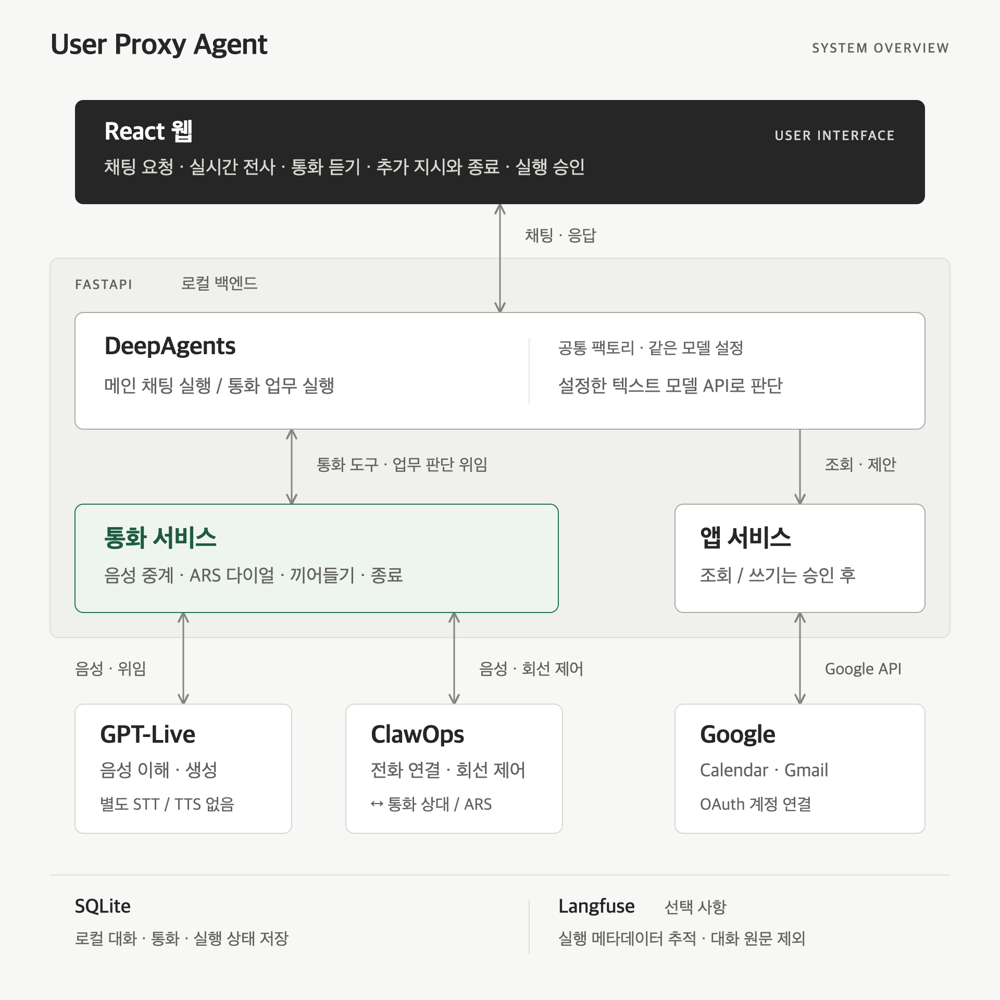

# User Proxy Agent

채팅으로 요청하면 일정·메일을 확인하고 전화를 걸어 처리하는 개인용 로컬 웹 서비스.
통화 중에는 실시간 전사를 읽거나 양쪽 음성을 듣고, 추가 지시를 보내거나 직접 종료할 수 있다.

## 현재 기능

- DeepAgents 기반 스트리밍 채팅, 마크다운, 응답 중단·재시도
- 대화 저장·전환·이름 변경·삭제, 첫 응답 이후 자동 제목 생성
- ClawOps와 GPT-Live의 직접 음성 연결, ARS 다이얼, 끼어들기 처리와 자동 종료
- 통화 중 채팅 질문·답변과 추가 지시, 종료 후 결과 자동 보고
- Google Calendar·Gmail 조회, 사용자 확인 후 일정 등록·메일 발송
- 선택적 로컬 Langfuse 실행 추적
- 실제 발신 없는 독립 가상 ARS와 디버그 웹 (macOS 로컬 음성)

메인 채팅과 업무 판단은 설정한 텍스트 모델이, 전화 음성 대화는 `gpt-live-1`이 맡는다.
Live가 업무 판단을 DeepAgents에 위임하며, 별도 STT/TTS 서비스는 붙이지 않는다.

본인 계정과 통화로 주요 흐름을 검증했다. 한국어 대화의 반복 질문·자연스러움과 응답 지연은
개선 중이다. [최근 음성 평가](docs/evaluations/2026-09-27-korean-dialogue.md)와
[단계별 검증 범위](docs/roadmap.md)에 확인된 동작과 남은 제한을 기록했다.

## 전체 구조

사용자는 채팅으로 요청하고, 통화와 앱 실행은 같은 대화 안에서 확인·제어한다.

[](docs/diagrams/architecture.svg)

DeepAgents의 메인 채팅과 통화 업무는 **별도로 실행**되며 같은 팩토리와 텍스트 모델 설정을
사용한다. 전화 음성은 통화 서비스를 거쳐 GPT-Live와 ClawOps 사이를 오간다.
Google 쓰기 작업은 사용자가 웹의 확인 카드를 승인한 뒤 실행한다.

읽기 편하도록 웹의 직접 통화 제어·실행 승인, 저장·추적 연결선은 생략했다.
통화 상대·ARS는 ClawOps 카드에, 텍스트 모델 API는 DeepAgents 카드에 함께 표시했다.
[확대 보기](docs/diagrams/architecture.svg) · [편집 원본과 구성 설명](docs/diagrams/README.md) ·
[모듈별 코드 구조](docs/code-structure.md)

## 시작하기

Python **3.12**, uv, Node.js **24 LTS**(24–26 지원), npm을 사용한다.
전화 없는 음성 평가의 합성 입력 생성은 macOS의 Yuna 음성을 사용한다.

```bash
cd backend
uv sync --locked
cd ../web
npm ci
cd ..

# 최초 설치에만 복사. 기존 .env는 유지한다.
test -f .env || cp .env.example .env
chmod 600 .env
```

`.env`에 `MODEL_BASE_URL`, `MODEL_API_KEY`, `MODEL_NAME`을 입력한 뒤 실행한다.
키를 `VITE_` 변수나 웹 코드에 넣지 않는다.

```bash
./scripts/dev.sh
```

- 웹: http://127.0.0.1:5180
- 백엔드 상태: http://127.0.0.1:9010/api/health
- 종료: 실행한 터미널에서 Ctrl-C

상태 확인은 로컬 서버 연결만 검사한다. 모델·전화·Google 연결 상태를 보증하지 않는다.
서버는 로컬 주소에만 바인딩하며, 공개 배포와 다중 사용자 로그인은 지원 범위 밖이다.

## 전화와 앱 연결

채팅만 사용할 때는 `.env.example`의 `CALLS_ENABLED=0`을 유지한다.
전화 사용 시 ClawOps 계정·키·발신번호와 음성 모델 주소·키를 설정한다.
번호와 목적을 포함한 명확한 발신 요청을 채팅으로 전달한다. 발신 승인 카드의 번호·목적·
첫 멘트·질문을 확인하고 **승인하고 전화 걸기**를 눌러야 실제 발신한다.
번호별 허용 목록은 없으며 현재 ClawOps 연동의 국내 번호 형식만 지원한다.

통화 중 **통화 듣기**는 양쪽 음성을 재생하고, **통화 종료**는 실제 회선 종료를 요청한다.
듣기 중지나 채팅 화면 이동만으로 통화가 끝나지는 않는다. 서비스는 한 번에 한 통화를 처리한다.
Google은 본인 OAuth 설정과 웹의 계정 동의가 필요하다. 일정 등록과 메일 발송은
모델이 제안한 내용을 확인 카드에서 검토한 뒤 실행한다.

- [모델·Google·Langfuse 설정](docs/configuration.md)
- [Google OAuth 설치 안내](docs/google-setup.md)
- [통화 운영·상태·진단](docs/calls.md)
- [ClawOps 없이 가상 ARS로 시험하기](docs/virtual-ars.md)
- [로컬 실행·백업·복구](docs/local-recovery.md)

## 개발과 검증

```bash
./scripts/check.sh
```

백엔드·웹 테스트, 정적 검사와 빌드를 실행한다. 로컬 `.env`를 배제하고 외부 모델·전화·Google을
모사한다. 브라우저 검사와 유료 API 음성 평가는 [스크립트 안내](scripts/README.md)에서 구분한다.

## 저장소 구조

| 경로 | 내용 |
| --- | --- |
| `backend/src/agent_service/` | 채팅, 통화, Google 연결, 확인 후 실행, 저장소 |
| `backend/tests/` | 백엔드 자동 검사 |
| `web/src/`, `web/e2e/` | React 화면과 웹 검사 |
| `web/src/api/`, `web/src/calls/` | 공통 HTTP 처리와 통화 기능 |
| `scripts/` | 로컬 실행, 검사, 합성 음성 평가 |
| `docs/` | 운영 안내, 제품 방향, 계획·검증 기록 |
| `.env.example` | 인증정보가 없는 설정 템플릿 |
| `data/`, `var/`, `.env` | 사용자 데이터·평가 결과·인증정보, Git 제외 |

이 디렉터리가 독립 저장소의 루트다. 이전 실험 프로젝트나 모델 다운로드 폴더는 실행에 필요하지 않다.
잠금 파일 `backend/uv.lock`, `web/package-lock.json`을 함께 버전 관리한다.

[제품 방향](docs/product.md) · [로드맵](docs/roadmap.md) · [작업 지침](AGENTS.md) ·
[코드 구조](docs/code-structure.md) · [저장소 업로드 범위](docs/repository.md)
